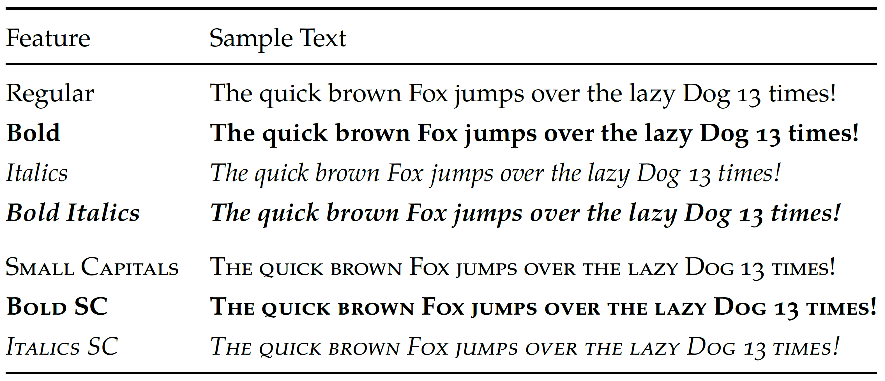
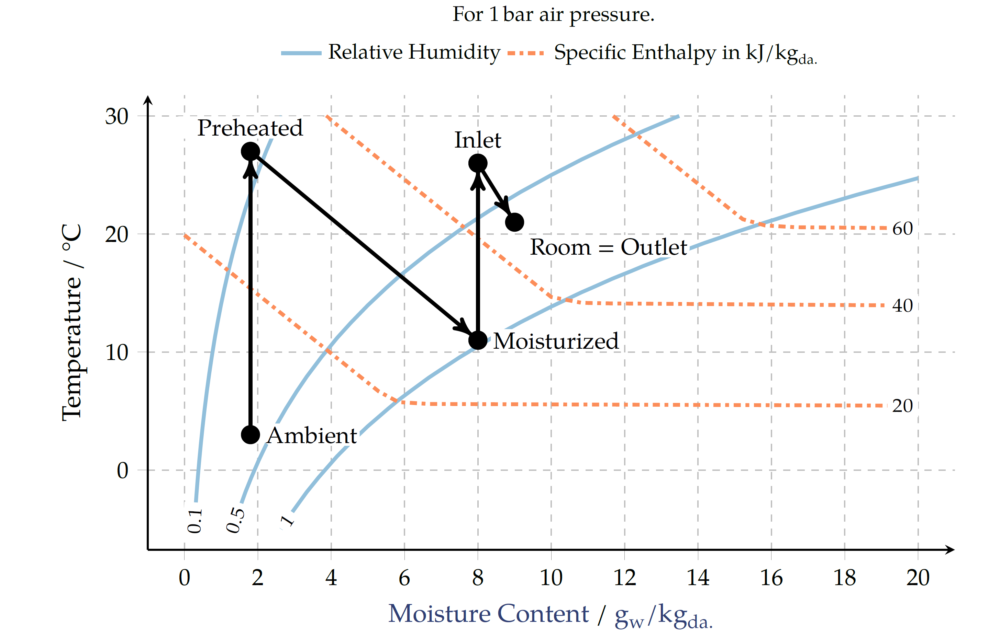
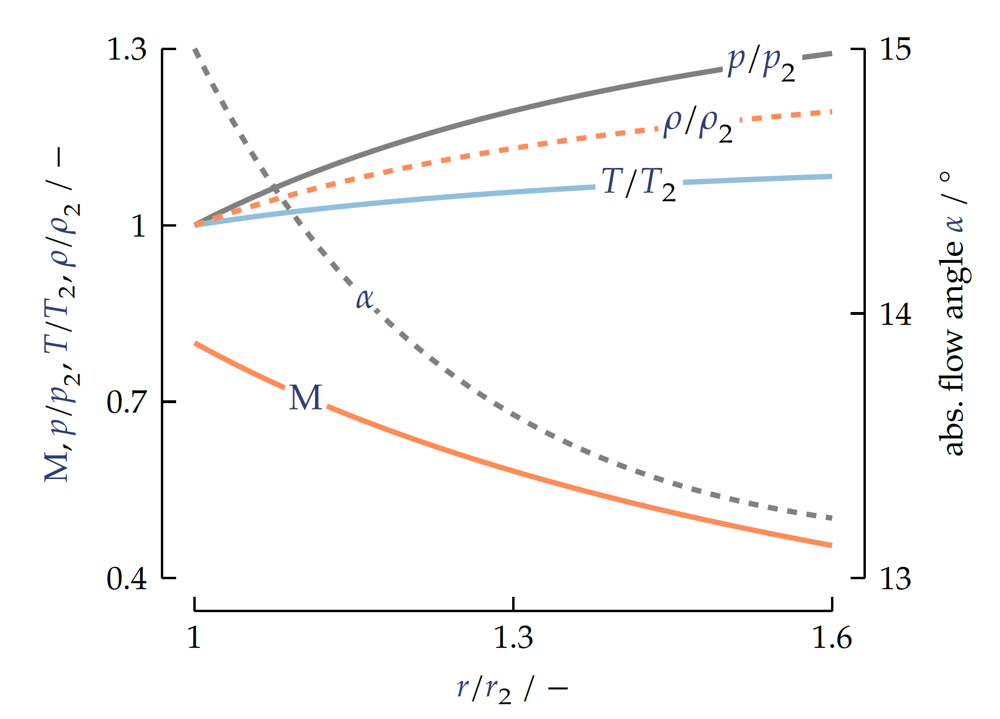
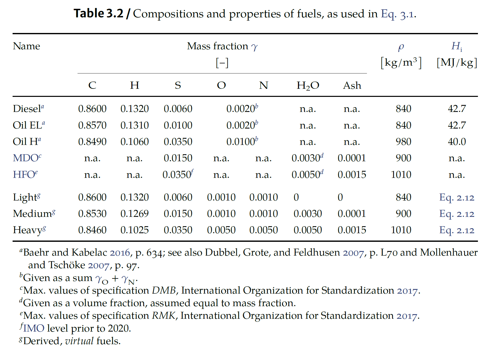
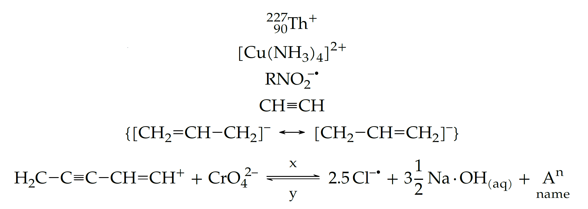
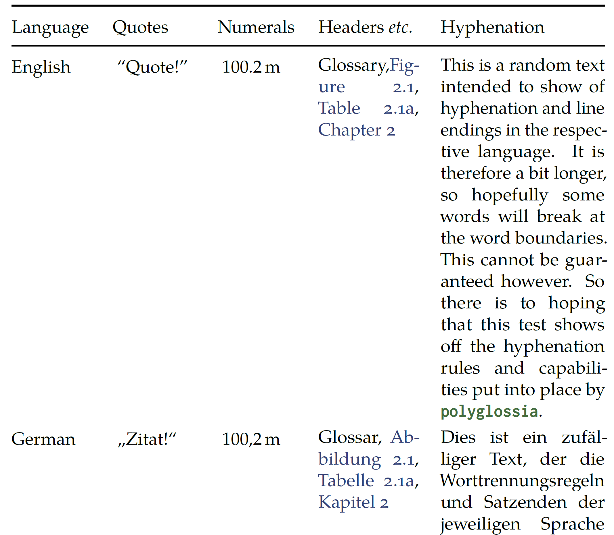
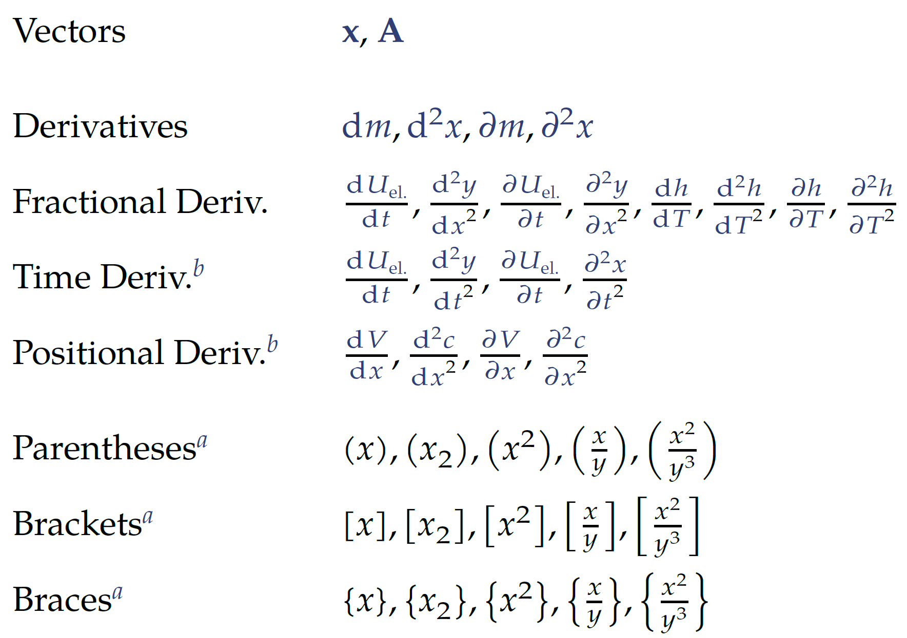

# LaTeX Cookbook

[][download]

This repo contains a [LaTeX document](cookbook.tex), usable as a cookbook (different "recipes" to achieve various things in LaTeX) as well as as a template.
The resulting PDF covers LaTeX-specific topics and instructions on compiling the LaTeX source.

See the [releases page](https://github.com/alexpovel/latex-cookbook/releases) for more downloads.

## Features

The [PDF itself][download] has much more to say on this and is meant to speak for itself, visually.
The following is simply a brief overview of the features contained in this repo.

### Tooling

- accompanying [Docker image](.devcontainer/image/Dockerfile), usable locally and in CI/CD, guaranteeing compilation success without interfering with your local installation.
  In fact, using Docker (containerization in general), no LaTeX installation is required at all.
  - accompanying Visual Studio Code [environment configuration](.devcontainer/devcontainer.json).

    If you open this repository in [Visual Studio Code](https://code.visualstudio.com/), it should automatically put you into the correct Docker container environment for development, and just work™.
    See [here](.devcontainer/README.md) for more info.
  - in the image, [`pandoc`](https://pandoc.org/) is available with the [Eisvogel](https://github.com/Wandmalfarbe/pandoc-latex-template) template, allowing beautiful PDFs to be generated from Markdown (like this README)
- [tests](tests/config.yml) for your PDF, using Python to ensure some (basic) properties of your output adhere to expectations
- a [Makefile](Makefile) to facilitate ease of use and platform independence (commands like `make file.pdf` work locally as well as in CI pipelines)

### LaTeX-specific

- full Unicode support through `lualatex`, the [successor](https://en.wikipedia.org/wiki/LuaTeX) to the obsolete `pdflatex`.
  This also affords beautiful font typesetting through [`unicode-math`](https://ctan.org/pkg/unicode-math).
  High-quality fonts like [TeX Gyre Pagella](https://ctan.org/pkg/tex-gyre-pagella) have all desirable font shapes available:
  
- automatic compilation using [`latexmk`](.latexmkrc), ensuring the PDF is built fully, running all steps necessary (generation of the bibliography, glossaries, ...) automatically as needed
- comprehensive support for:
  - generating [indices](bib/glossaries/index/),
  - typesetting and displaying [symbols](bib/glossaries/symbols/) in an automatically generated nomenclature,
  - [acronyms and abbreviations](bib/glossaries/abbreviations.bib), as well as
  - [mathematical constants](bib/glossaries/constants.bib),

  made possible through [`glossaries-extra`](https://ctan.org/pkg/glossaries-extra).
- structured and commented source code, explaining rationales and providing context
- showcasing plotting and data display (floats):
  - computing more complicated plots (in this example, a contour plot) *directly in LaTeX*, with no explicit outside tools used ([`gnuplot`](http://www.gnuplot.info/) is used by LaTeX in the background):

    
  - ingesting a CSV directly, and plotting it (so we can skip [`matlab2tikz`](https://www.mathworks.com/matlabcentral/fileexchange/22022-matlab2tikz-matlab2tikz) etc.).
    The below style is inspired by [Tufte](https://www.edwardtufte.com/tufte/):

    
  - typesetting more complex tables, with footnotes, decimal alignment and more:

    
  - using tikz:
    - for annotating bitmap graphics:

      
    - for drawing diagrams (this template contains a (basic) `pgf`/`tikz` library for energy systems/thermodynamics/hydraulics/... symbols like pipes, compressors, valves, ...) and 3D sketches.
      For a much better and comprehensive collection of TikZ examples, see [here](https://texample.net/tikz/examples/).

      
      
- back-referencing of citations, using the excellent [`biblatex`](https://ctan.org/pkg/biblatex):

  
- support for elaborate chemical reaction equations, using [`chemmacros`](https://ctan.org/pkg/chemmacros):

  
- comprehensive code syntax highlighting, thanks to [`minted`](https://ctan.org/pkg/minted) and `pygments`:

  
- quick and structural switching of language contexts, provided by [`polyglossia`](https://ctan.org/pkg/polyglossia):

  
- of course, support for enhanced mathematical typesetting, like highlighted equations or premade macros.
  The blue color are *hyperlinks*, turning those symbols into links to the glossary (this can be toggled off).

  

  

[download]: https://github.com/alexpovel/latex-cookbook/releases/latest/download/cookbook.pdf
